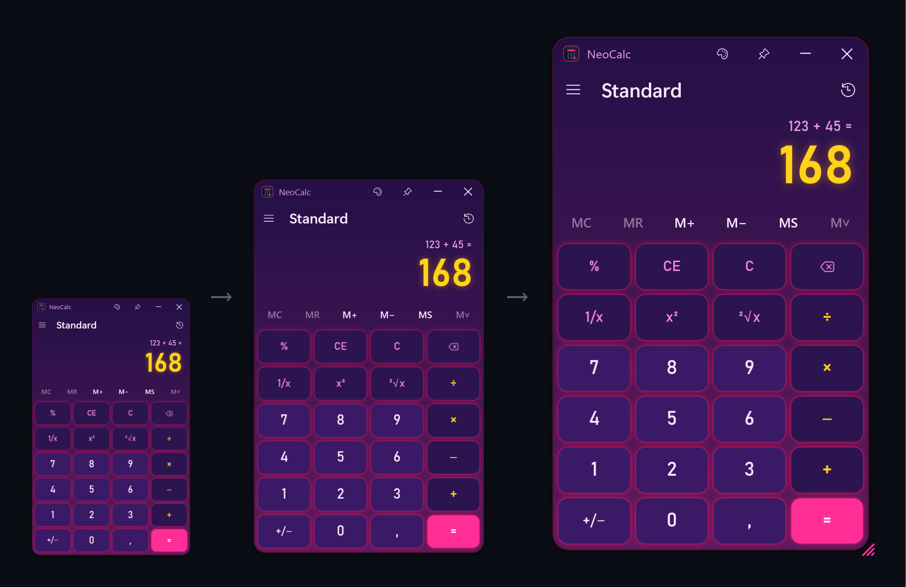

# NeoCalc — der Windows-Rechner, mit 26 Designs und vollständig anpassbar

[Español](README.md) · [English](README.en.md) · [Português](README.pt.md) · [Français](README.fr.md) · **Deutsch** · [Italiano](README.it.md) · [Polski](README.pl.md) · [Русский](README.ru.md) · [한국어](README.ko.md) · [日本語](README.ja.md)

Standard- und wissenschaftlicher Rechner für **Windows 10 und 11**, der wie der Windows-Rechner funktioniert, aber mit
**26 integrierten Designs** und einem Editor für eigene: Farben, Verläufe, Hintergrundbild, Schriftarten,
runde Tasten, Neonleuchten, LCD-Anzeige… Eine einzige `.exe` mit etwa 200 KB, ohne Installation.

**Website:** https://divolandialabs.github.io/neocalc/ · **Download:** [neueste Version](https://github.com/DivolandiaLabs/NeoCalc/releases/latest)


## Funktionen

- **Standardmodus** genau wie der Windows-Rechner: Rechnungen werden verkettet (3 + 5 × 2 = 16), `=` wiederholt die letzte Rechnung und `%` verhält sich gleich.
- **Wissenschaftlicher Modus** mit Operatorrangfolge und Klammern (3 + 5 × 2 = 13), `2nd`, DEG/RAD/GRAD, wissenschaftliche Notation (F-E), Trigonometrie, Logarithmen, Potenzen, Wurzeln, `n!` (auch mit Dezimalzahlen), `mod` und `exp`.
- **Verlauf und Speicher** (MC, MR, M+, M−, MS): in einem Seitenbereich bei breitem Fenster oder über den Tasten bei schmalem.
- **Beliebige Größe**: Ziehen Sie an der Ecke, und der ganze Rechner wird größer oder kleiner; beim nächsten Start öffnet er sich in der zuletzt gewählten Größe.
- **Volle Tastaturbedienung**, Kopieren und Einfügen sowie die Schaltfläche **Immer im Vordergrund**.
- **26 Designs**: Windows dunkel und hell, Cyber-Neon, Synthwave, Matrix, Retro-LCD, Bernstein-Terminal, Dracula, Nordisch, Game Boy, Hologramm, Glas, Rund (iPhone-Stil), Gold und Schwarz, Vaporwave…
- **Design-Editor** mit Live-Vorschau, Farbwähler mit Transparenz, Schaltfläche **Zufällig** und **Import/Export** von Designs (`.neocalc.json`).
- **Taskleistensymbol** in den Designfarben, auch wenn das Programm angeheftet ist.
- **10 Sprachen**: Spanisch, Englisch, Portugiesisch, Französisch, Deutsch, Italienisch, Polnisch, Russisch, Koreanisch und Japanisch.




## Installation

1. Laden Sie `NeoCalc.exe` von der [Release-Seite](https://github.com/DivolandiaLabs/NeoCalc/releases/latest) herunter.
2. Speichern Sie die Datei an einem beliebigen Ort (z. B. `Dokumente\NeoCalc`) und öffnen Sie sie. Keine Installation nötig.
3. Für schnellen Zugriff: Rechtsklick auf das Taskleistensymbol → **An Taskleiste anheften**.

Windows SmartScreen kann beim ersten Start warnen, weil das Programm nicht signiert ist: Klicken Sie auf **Weitere Informationen → Trotzdem ausführen**.

Zum Deinstallieren einfach die `.exe` und bei Bedarf den Ordner `%APPDATA%\NeoCalc` löschen.

## Designs und Anpassung

Öffnen Sie den Editor mit der Paletten-Schaltfläche 🎨 oder **Strg+T**. Ein gewähltes Design wird sofort angewendet; ändern Sie
etwas an einem integrierten Design, entsteht eine Kopie unter **Meine Designs** und das Original bleibt unverändert.


Anpassbar sind: die Hintergrundfarben (Verlauf und Winkel), ein Hintergrundbild, die Fensterdeckkraft, die Ecken, Hintergrund
und Ziffern der Anzeige, ein LCD-Rahmen, die Farben jeder Tastenart, Schriftarten und -stärke, die Textgröße, die Tastenrundung
(bis hin zu runden Tasten), der Abstand, der Rahmen und das Neonleuchten.

## Tastenkürzel

| Taste | Aktion |
|---|---|
| `0`–`9`, `,` `.` | Zahlen eingeben |
| `+` `-` `*` `/` `Eingabe` | Operatoren / gleich |
| `Rücktaste` · `Entf` · `Esc` | Ziffer löschen · CE · C |
| `F9` · `R` · `@` · `Q` | +/− · 1/x · Wurzel · x² |
| `(` `)` `^` `!` `%` | Klammern, Potenz, Fakultät, mod (wissenschaftlich) |
| `Alt+1` · `Alt+2` | Standard · Wissenschaftlich |
| `Strg+M` `Strg+R` `Strg+P` `Strg+Q` `Strg+L` | MS · MR · M+ · M− · MC |
| `Strg+H` · `Strg+T` | Verlauf · Designs |
| `Strg+C` · `Strg+V` | Kopieren · Einfügen |

## Aus dem Quellcode kompilieren

Nichts zu installieren: Kompiliert wird mit dem C#-Compiler, der bereits in Windows enthalten ist (.NET Framework 4.8).

```powershell
powershell -ExecutionPolicy Bypass -File build.ps1
```

Das Symbol zeichnet das Programm selbst (`src\Icono.cs`). Zum Prüfen der Rechenlogik: `NeoCalc.exe /prueba ergebnis.txt`.

## Datenschutz

NeoCalc stellt keine Internetverbindung her und sammelt keine Daten. Einstellungen, Verlauf und Ihre Designs werden nur auf
Ihrem Computer gespeichert, in `%APPDATA%\NeoCalc\config.json`.

## Voraussetzungen

Windows 10 oder 11 (enthält .NET Framework 4.8).

---

© 2026 Divolandia Labs · [divolandialabs.github.io](https://divolandialabs.github.io/) · Fragen oder Ideen? [Issue eröffnen](https://github.com/DivolandiaLabs/NeoCalc/issues).
