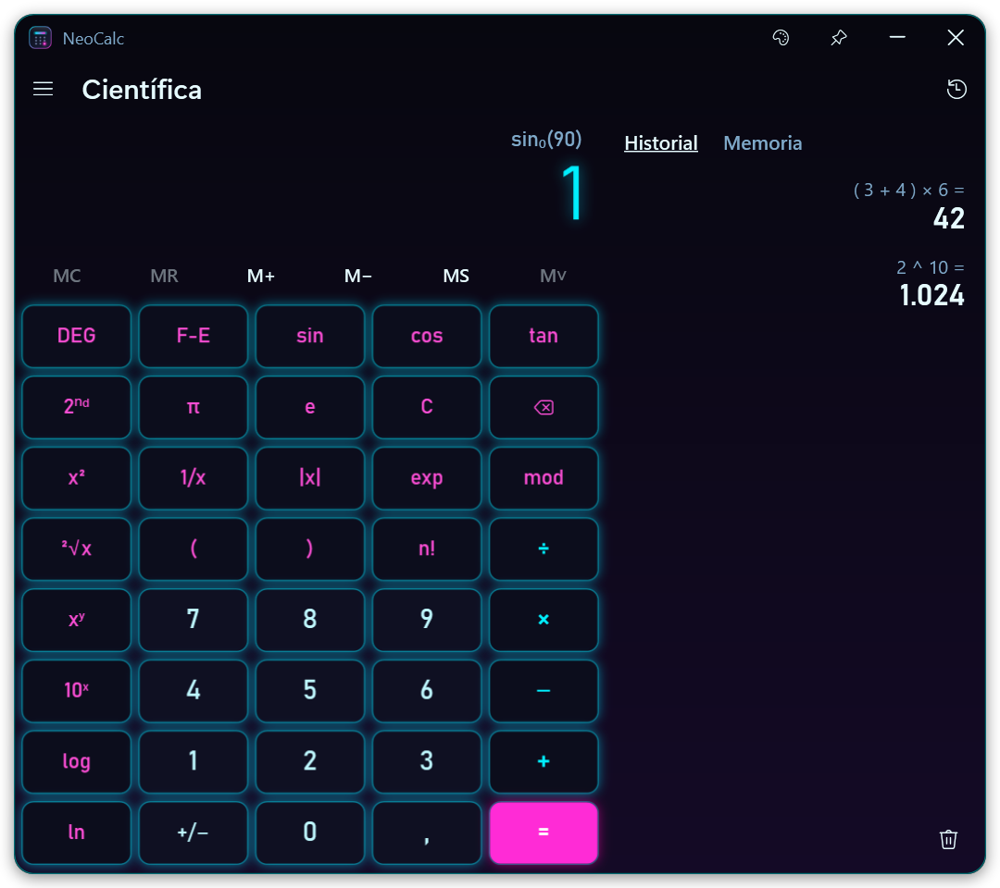
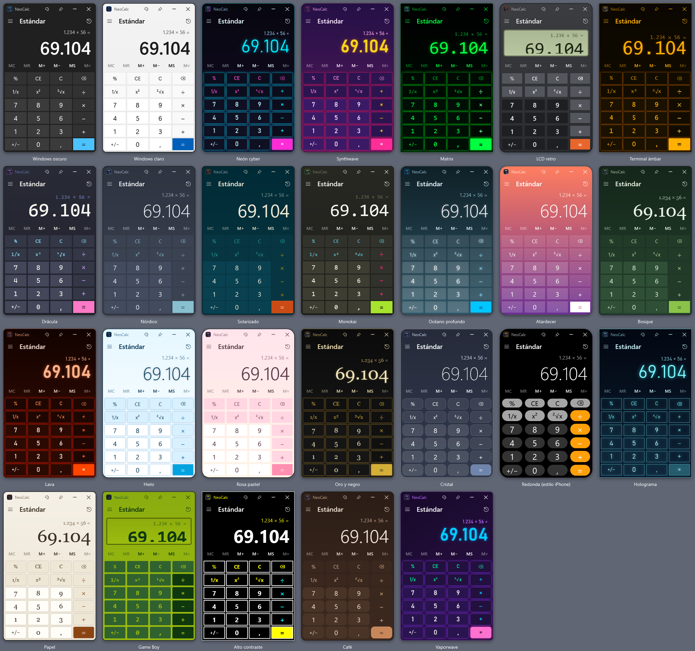
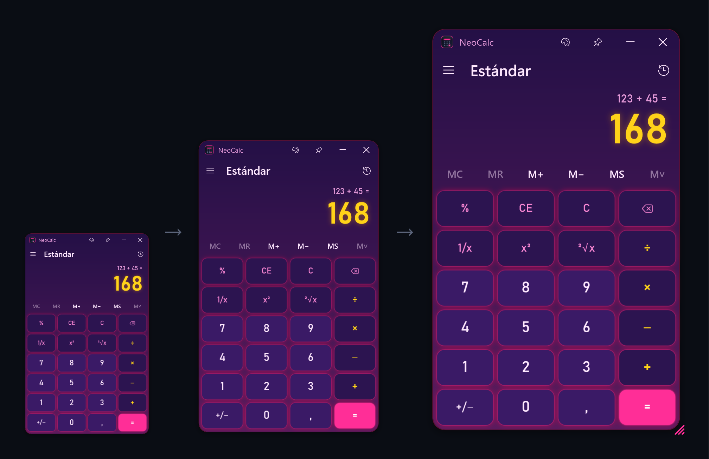
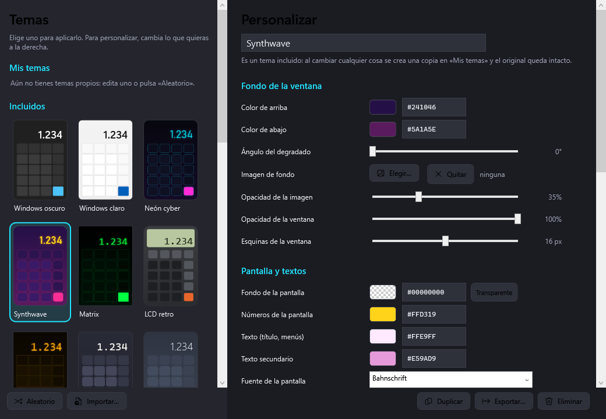

# NeoCalc — la calculadora de Windows, con 26 temas y totalmente personalizable

**Español** · [English](README.en.md) · [Português](README.pt.md) · [Français](README.fr.md) · [Deutsch](README.de.md) · [Italiano](README.it.md) · [Polski](README.pl.md) · [Русский](README.ru.md) · [한국어](README.ko.md) · [日本語](README.ja.md)

Calculadora estándar y científica para **Windows 10 y 11** que funciona como la de Windows, pero con
**26 temas incluidos** y un editor para crear los tuyos: colores, degradados, imagen de fondo, fuentes,
teclas redondas, brillo neón, pantalla LCD… Un solo `.exe` de unos 200 KB, sin instalación.

**Web:** https://divolandialabs.github.io/neocalc/ · **Descarga:** [última versión](https://github.com/DivolandiaLabs/NeoCalc/releases/latest)



## Qué hace

- **Modo estándar** igual que la calculadora de Windows: las operaciones se encadenan (3 + 5 × 2 = 16), `=` repite la última operación y `%` funciona igual.
- **Modo científico** con prioridad de operadores y paréntesis (3 + 5 × 2 = 13), `2nd`, DEG/RAD/GRAD, notación científica (F-E), trigonometría, logaritmos, potencias, raíces, `n!` (también con decimales), `mod` y `exp`.
- **Historial y memoria** (MC, MR, M+, M−, MS): en un panel lateral si la ventana es ancha, o por encima de las teclas si es estrecha.
- **Tamaño a tu gusto**: estira la ventana desde la esquina y toda la calculadora crece o se encoge; la próxima vez se abrirá con el último tamaño que dejaste.
- **Teclado completo**, copiar y pegar, y botón **Siempre encima**.
- **26 temas**: Windows oscuro y claro, Neón cyber, Synthwave, Matrix, LCD retro, Terminal ámbar, Drácula, Nórdico, Game Boy, Holograma, Cristal, Redonda (estilo iPhone), Oro y negro, Vaporwave…
- **Editor de temas** con vista previa al momento, selector de color con transparencia, botón **Aleatorio** e **importar/exportar** temas (`.neocalc.json`).
- **Icono de la barra de tareas** con los colores del tema, también cuando el programa está anclado.
- **10 idiomas**: español, inglés, portugués, francés, alemán, italiano, polaco, ruso, coreano y japonés.





## Instalar

1. Descarga `NeoCalc.exe` de la [página de versiones](https://github.com/DivolandiaLabs/NeoCalc/releases/latest).
2. Guárdalo donde quieras (por ejemplo en `Documentos\NeoCalc`) y ábrelo. No necesita instalación.
3. Para tenerlo a mano: clic derecho en su icono de la barra de tareas → **Anclar a la barra de tareas**.

Windows SmartScreen puede avisar la primera vez porque el programa no está firmado: pulsa **Más información → Ejecutar de todas formas**.

Para desinstalarlo basta con borrar el `.exe` y, si quieres, la carpeta `%APPDATA%\NeoCalc`.

## Temas y personalización

Abre el editor con el botón de la paleta 🎨 o con **Ctrl+T**. Al elegir un tema se aplica al momento; si cambias algo de un
tema incluido se crea una copia en **Mis temas** y el original queda intacto.



Se puede cambiar: los colores del fondo (degradado y ángulo), una imagen de fondo, la opacidad de la ventana, las esquinas,
el fondo y los números de la pantalla, el marco tipo LCD, los colores de cada tipo de tecla, las fuentes y su grosor, el tamaño
del texto, el redondeo de las teclas (hasta dejarlas redondas), la separación, el borde y el brillo neón.

## Atajos de teclado

| Tecla | Acción |
|---|---|
| `0`–`9`, `,` `.` | Escribir números |
| `+` `-` `*` `/` `Intro` | Operar / igual |
| `Retroceso` · `Supr` · `Esc` | Borrar dígito · CE · C |
| `F9` · `R` · `@` · `Q` | +/− · 1/x · raíz · x² |
| `(` `)` `^` `!` `%` | Paréntesis, potencia, factorial, mod (científica) |
| `Alt+1` · `Alt+2` | Estándar · Científica |
| `Ctrl+M` `Ctrl+R` `Ctrl+P` `Ctrl+Q` `Ctrl+L` | MS · MR · M+ · M− · MC |
| `Ctrl+H` · `Ctrl+T` | Historial · Temas |
| `Ctrl+C` · `Ctrl+V` | Copiar · Pegar |

## Compilar desde el código

No hace falta instalar nada: se compila con el compilador de C# que ya trae Windows (.NET Framework 4.8).

```powershell
powershell -ExecutionPolicy Bypass -File build.ps1
```

El icono lo dibuja el propio programa (`src\Icono.cs`). Para comprobar el motor de cálculo: `NeoCalc.exe /prueba resultado.txt`.

## Privacidad

NeoCalc no se conecta a internet ni recoge ningún dato. Los ajustes, el historial y tus temas se guardan solo en tu equipo,
en `%APPDATA%\NeoCalc\config.json`.

## Requisitos

Windows 10 u 11 (incluye .NET Framework 4.8).

---

© 2026 Divolandia Labs · [divolandialabs.github.io](https://divolandialabs.github.io/) · ¿Dudas o ideas? [Abre una incidencia](https://github.com/DivolandiaLabs/NeoCalc/issues).
