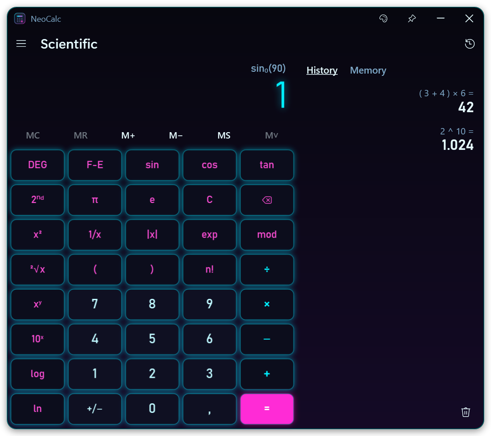
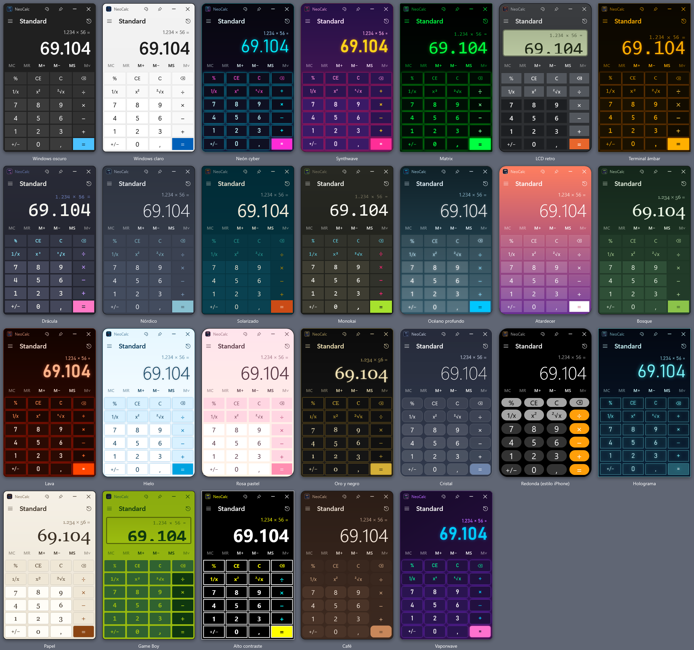
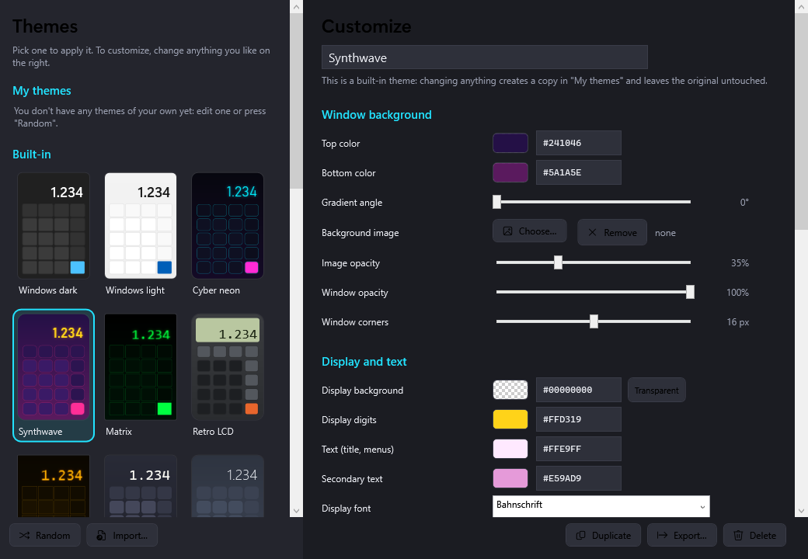

# NeoCalc — kalkulator z Windows, z 26 motywami i w pełni konfigurowalny

[Español](README.md) · [English](README.en.md) · [Português](README.pt.md) · [Français](README.fr.md) · [Deutsch](README.de.md) · [Italiano](README.it.md) · **Polski** · [Русский](README.ru.md) · [한국어](README.ko.md) · [日本語](README.ja.md)

Kalkulator standardowy i naukowy dla **Windows 10 i 11**, który działa jak kalkulator z Windows, ale ma
**26 wbudowanych motywów** i edytor do tworzenia własnych: kolory, gradienty, obraz tła, czcionki,
okrągłe klawisze, neonowa poświata, wyświetlacz LCD… Jeden plik `.exe` o rozmiarze ok. 200 KB, bez instalacji.

**Strona:** https://divolandialabs.github.io/neocalc/ · **Pobieranie:** [najnowsza wersja](https://github.com/DivolandiaLabs/NeoCalc/releases/latest)



## Co potrafi

- **Tryb standardowy** dokładnie jak kalkulator Windows: działania są łączone po kolei (3 + 5 × 2 = 16), `=` powtarza ostatnie działanie, a `%` działa tak samo.
- **Tryb naukowy** z kolejnością działań i nawiasami (3 + 5 × 2 = 13), `2nd`, DEG/RAD/GRAD, notacja naukowa (F-E), trygonometria, logarytmy, potęgi, pierwiastki, `n!` (także dla ułamków), `mod` i `exp`.
- **Historia i pamięć** (MC, MR, M+, M−, MS): w panelu bocznym, gdy okno jest szerokie, lub nad klawiszami, gdy jest wąskie.
- **Pełna obsługa klawiatury**, kopiowanie i wklejanie oraz przycisk **Zawsze na wierzchu**.
- **26 motywów**: Windows ciemny i jasny, Cyber neon, Synthwave, Matrix, Retro LCD, Bursztynowy terminal, Dracula, Nordycki, Game Boy, Hologram, Szkło, Okrągła (styl iPhone), Złoto i czerń, Vaporwave…
- **Edytor motywów** z podglądem na żywo, próbnikiem kolorów z przezroczystością, przyciskiem **Losowy** oraz **importem/eksportem** motywów (`.neocalc.json`).
- **Ikona na pasku zadań** w kolorach motywu, także gdy program jest przypięty.
- **10 języków**: hiszpański, angielski, portugalski, francuski, niemiecki, włoski, polski, rosyjski, koreański i japoński.



## Instalacja

1. Pobierz `NeoCalc.exe` ze [strony wydań](https://github.com/DivolandiaLabs/NeoCalc/releases/latest).
2. Zapisz go w dowolnym miejscu (np. `Dokumenty\NeoCalc`) i otwórz. Nie wymaga instalacji.
3. Aby mieć go pod ręką: kliknij prawym przyciskiem jego ikonę na pasku zadań → **Przypnij do paska zadań**.

Windows SmartScreen może za pierwszym razem wyświetlić ostrzeżenie, bo program nie jest podpisany: kliknij **Więcej informacji → Uruchom mimo to**.

Aby go odinstalować, wystarczy usunąć plik `.exe` i, jeśli chcesz, folder `%APPDATA%\NeoCalc`.

## Motywy i personalizacja

Edytor otworzysz przyciskiem palety 🎨 lub skrótem **Ctrl+T**. Wybrany motyw jest stosowany od razu; jeśli zmienisz coś w motywie
wbudowanym, w **Moje motywy** powstanie kopia, a oryginał pozostanie bez zmian.



Możesz zmienić: kolory tła (gradient i kąt), obraz tła, krycie okna, narożniki, tło i cyfry wyświetlacza, ramkę w stylu LCD,
kolory każdego rodzaju klawiszy, czcionki i ich grubość, rozmiar tekstu, zaokrąglenie klawiszy (aż do okrągłych), odstępy,
obramowanie i neonową poświatę.

## Skróty klawiszowe

| Klawisz | Działanie |
|---|---|
| `0`–`9`, `,` `.` | Wpisywanie liczb |
| `+` `-` `*` `/` `Enter` | Operatory / równa się |
| `Backspace` · `Delete` · `Esc` | Usuń cyfrę · CE · C |
| `F9` · `R` · `@` · `Q` | +/− · 1/x · pierwiastek · x² |
| `(` `)` `^` `!` `%` | Nawiasy, potęga, silnia, mod (naukowy) |
| `Alt+1` · `Alt+2` | Standardowy · Naukowy |
| `Ctrl+M` `Ctrl+R` `Ctrl+P` `Ctrl+Q` `Ctrl+L` | MS · MR · M+ · M− · MC |
| `Ctrl+H` · `Ctrl+T` | Historia · Motywy |
| `Ctrl+C` · `Ctrl+V` | Kopiuj · Wklej |

## Kompilacja ze źródeł

Nie trzeba niczego instalować: program kompiluje się kompilatorem C# dostępnym w Windows (.NET Framework 4.8).

```powershell
powershell -ExecutionPolicy Bypass -File build.ps1
```

Ikonę rysuje sam program (`src\Icono.cs`). Aby sprawdzić silnik obliczeń: `NeoCalc.exe /prueba wynik.txt`.

## Prywatność

NeoCalc nigdy nie łączy się z internetem i nie zbiera żadnych danych. Ustawienia, historia i Twoje motywy są zapisywane tylko na
Twoim komputerze, w `%APPDATA%\NeoCalc\config.json`.

## Wymagania

Windows 10 lub 11 (zawiera .NET Framework 4.8).

---

© 2026 Divolandia Labs · [divolandialabs.github.io](https://divolandialabs.github.io/) · Pytania lub pomysły? [Zgłoś problem](https://github.com/DivolandiaLabs/NeoCalc/issues).
